<!-- ──────────────────────────────────────────────────────────────────────── -->
<!--  ⚡  @ShivamGawade-XS  ·  GitHub Profile README  ·  v7.0  ·  2026       -->
<!--                                                                          -->
<!--  FILES TO COMMIT (3 total):                                              -->
<!--    README.md    ← this file                                              -->
<!--    header.svg   ← self-hosted animated banner  (always works)           -->
<!--    contrib.svg  ← self-hosted animated grid    (always works)           -->
<!--    .github/workflows/snake.yml  ← optional: real snake once you push    -->
<!-- ──────────────────────────────────────────────────────────────────────── -->


<!-- ══ HEADER — self-hosted SVG, always works ════════════════════════════ -->

<div align="center">

</div>

<br>

<!-- ══ TYPING SVG + SOCIAL BADGES ═══════════════════════════════════════ -->

<div align="center">


<br><br>

[](https://linkedin.com/in/shivam-gawade)
[](https://github.com/ShivamGawade-XS)
[](mailto:shivamgawdemains06@gmail.com)
[](https://github.com/ShivamGawade-XS)

<br>

<!-- Achievement badges — above the fold, always visible ──────────────── -->


</div>

<br>

---

<!-- ══ BOOT + STATUS ══════════════════════════════════════════════════════ -->

```bash
╔═════════════════════════════════════════════════════════════════════════════╗
║   SESSION INIT    ShivamGawade-XS@github:~$                             ║
║                                                                             ║
║  ▶ kernel    ████████████████████████████████  100%  [ OK ]               ║
║  ▶ firewall  ████████████████████████████████  100%  [ OK ]               ║
║  ▶ shell     ████████████████████████████████  100%  [ OK ]               ║
║                                                                             ║
║  ┌─────────────────────────────────────────────────────────────────────┐   ║
║  │  🟢  OPEN TO  →  Internships · Hackathon Teams · OSS Collab         │   ║
║  │  📍  Goa, India  ·  B.E. ECE 2nd Year  ·  CGPA 8.4 / 10           │   ║
║  └─────────────────────────────────────────────────────────────────────┘   ║
║                                                                             ║
║  $ echo "Building at the intersection of code, circuits & community"      ║
║  ↳  Building at the intersection of code, circuits & community             ║
║                                                                             ║
║  ShivamGawade-XS@github:~$ ▌                                               ║
╚═════════════════════════════════════════════════════════════════════════════╝
```

<br>

---

<!-- ══ PORTRAIT + SYSINFO ════════════════════════════════════════════════ -->

<table align="center" border="0" cellspacing="14" cellpadding="0">
<tr>
<td valign="top" width="50%">
<pre>
┌──────────────────────────────────────────────────────┐
│                                                      │
│  =====**#*#%%%%%%%%%%%%%%%%%%%%%%%%%%%%%%%%%%%%%%%%  │
│  =====*****%%%%%%%%%%%%%%%%%%%%%%%%%%%%%%%%%%%%%%%%  │
│  =====****#%%%%%%%%%%%%%%%%%%%%%%%%%%%%%%%%%%%%%%%%  │
│  =====***#*%%%%%%%%%%#%%%%%%%%%%%%%%%%%%%%%%%%%%%%%  │
│  =====*#*##%%%%%%%%%#*+-=***%%%%%%%%%%%%%%%%%%%%%%%  │
│  =====****#%%%%%%%*:-:::::.:::=*%%%%%%%%%%%%%%%%%%%  │
│  =====****#%%%%%=:...       ...:*%%%%%%%%%%%%%%%%%%  │
│  =====#**##%%%%*:.:..   .  . . ..:%%%%%%%%%%%%%%%%%  │
│  ====+##*##%%%+:....             .%%%%%%%%%%%%%%%%%  │
│  ====+***##%%#:..:.   .:-===-:: .*%%%%%%%%%%%%%%%%%  │
│  ====+#**##%%%-:.   -===+**+==-:+#########%%%%%%%%%  │
│  ====*####%%%%*. .-+******=:...-=#****########%##%%  │
│  ====*#**#%%%%%% :+=-==:-*-::::-:-********########%  │
│  ====*#*#*%%%%%%%:=+-==+***=+++=-=**********######%  │
│  ====*#*##%%%%%%=*=**##**==:-+==-=+++*******#######  │
│  ====*##**%%%%%%%**=+***+--=-:--=+++++*******######  │
│  ====**#*#%%%%%%%%**++*-:+++-=--++++++******######%  │
│  ====*#*#*%%%%%%%%%%%===++==+=-:=++++++*****#####%%  │
│  ====#****%%%%%%%%%%%*=====-:.::: =++++*****#######  │
│  ====#*#*#%%%%%%%%%%%:===::.:::::..:+++******######  │
│  ==-=***##%%%%%%%:::::=+===::---:....:::+****####%%  │
│  ==:=*****%%+-::.:::::.=======--:......::::***#####  │
│  ====#***=::.::: :::. :==+==+==.   ..:::::::::**###  │
│  ====#**=:::.:::.:::.:..=++***+. ...:::::::::::-**#  │
│  ===+**+::::..::.:::.::::=***-: ..::::::::::::..+**  │
│  ===+**::::::..:.:::.::.-:+*-: ..::::::::::::.:::+*  │
│  ===+**::::..:.::::::.::::+-  .::::::.::.:::....:=+  │
│  ===+*-::::..:..::::::.::.-  :::::::..:.:::::...:=+  │
│  ===**:::::...:.::::::.::. .:::::::: .:.:::.:....==  │
│  ===+:::::::. ::..::::... ..:::::.:..:.:..:::...:==  │
│  ===+::::::... .....:.::..:.::::.:. .::::::...:.:-=  │
│  ===::::::...  .......:.:.:..::.... .::::.:.:...:-=  │
│  ==-::::::..  :..............:...   :::::..:.:..:-=  │
│  -=:::::.... .==:.:::.....::==++==-:::.::::.:..::==  │
│  -=:::...:::::::::::::=+++++****+==:.:::::::...::-=  │
│  =-:.::::::::::::::::=***++****+==:...::::::...::-=  │
│  -=:::::::::::.::::.:+++=====::::::::.:::::...::-==  │
│                                                      │
│  ▓▓▓▓▓▓▓▓▓▓▓▓▓▓▓▓▓▓▓▓▓▓▓▓▓▓▓▓▓▓▓▓▓▓▓▓▓▓▓▓▓▓▓▓▓▓▓▓▓▓  │
│           ShivamGawade-XS  ·  Goa, India           │
│  ▓▓▓▓▓▓▓▓▓▓▓▓▓▓▓▓▓▓▓▓▓▓▓▓▓▓▓▓▓▓▓▓▓▓▓▓▓▓▓▓▓▓▓▓▓▓▓▓▓▓  │
│                                                      │
│  AITD · B.E. ECE · 2024 – 28   ·   CGPA  8.4 / 10  │
└──────────────────────────────────────────────────────┘
</pre>
</td>
<td valign="top" width="50%">
<pre>
┌──────────────────────────────────────────────────────┐
│                                                      │
│   ShivamGawade-XS@github:~$                         │
│   ────────────────────────────────────────────────   │
│   OS       ··  Debian Linux / Windows 11            │
│   Host     ··  Goa, India                           │
│   Shell    ··  zsh  ·  oh-my-zsh                    │
│   IDE      ··  Visual Studio Code                   │
│   Active   ··  Since July 2024                      │
│   ────────────────────────────────────────────────   │
│   Lang     ··  Python · C · C++ · JS · PHP · SQL   │
│   Security ··  OWASP · JWT · OAuth 2.0 · Pentest   │
│   AI / ML  ··  ML · GenAI · NLP · Prompt Eng.      │
│   Hardware ··  Arduino · KiCAD · Analog Circuits    │
│   Tools    ··  Git · GitHub · VS Code · Figma       │
│   ────────────────────────────────────────────────   │
│   Learning ··  Web3 · Solidity · Adv Security       │
│   Builds   ··  CodeHive  |  2,000+ members          │
│   ────────────────────────────────────────────────   │
│   Email    ··  shivamgawdemains06@gmail.com         │
│   GitHub   ··  /ShivamGawade-XS                     │
│   LinkedIn ··  /in/shivam-gawade                    │
│                                                      │
└──────────────────────────────────────────────────────┘
</pre>
</td>
</tr>
</table>

<br>

---

<!-- ══ EDUCATION ══════════════════════════════════════════════════════════ -->

```bash
┌─────────────────────────────────────────────────────────────────────────────┐
│  🎓  E D U C A T I O N                                                     │
├─────────────────────────────────────────────────────────────────────────────┤
│                                                                             │
│   Agnel Institute of Technology and Design              Goa, India       │
│  Bachelor of Engineering — Electronics & Computer Engineering               │
│  July 2024 – 2028  ·  Affiliated to Goa University                        │
│                                                                             │
│  CGPA   ████████████████████████████░░░░░░   8.4 / 10   (upto Sem 3)      │
│                                                                             │
└─────────────────────────────────────────────────────────────────────────────┘
```

<br>

---

<!-- ══ PERSONALITY ════════════════════════════════════════════════════════ -->

```bash
┌─────────────────────────────────────────────────────────────────────────────┐
│  🧠  W H A T   D R I V E S   M E                                           │
├─────────────────────────────────────────────────────────────────────────────┤
│                                                                             │
│  🔐  I break things to understand them — then build them stronger          │
│  ⚡  I design the circuit AND write the firmware that runs on it            │
│  👥  I teach 2,000+ people skills I am still learning myself               │
│  🔭  Obsessing over  →  API Security  ·  Web3  ·  AI Systems              │
│  🌐  Belief: every real problem has both a software AND hardware answer    │
│                                                                             │
└─────────────────────────────────────────────────────────────────────────────┘
```

<br>

---

<!-- ══ SKILL BADGES ═══════════════════════════════════════════════════════ -->

<div align="center">

**`Languages`**


**`Web`**


**`Security`**


**`AI & Data`**


**`Hardware & Tools`**


**`Web3  [ WIP ]`**


</div>

<br>

---

<!-- ══ PROJECTS ════════════════════════════════════════════════════════════ -->

```bash
┌─────────────────────────────────────────────────────────────────────────────┐
│  ⚙   P R O J E C T S                                                       │
├─────────────────────────────────────────────────────────────────────────────┤
│                                                                             │
│  [ 01 ]  AI Career Guidance & Job Matching Platform              [ 2025 ]  │
│          ├── Python  ·  Machine Learning  ·  REST API                      │
│          └── Intelligent profile analysis & personalized career paths      │
│                                                                             │
│  [ 02 ]  SCAS — Smart Classroom Attendance System                [ 2025 ]  │
│          ├── HTML  ·  CSS  ·  JavaScript  ·  PHP  ·  MySQL                │
│          └── Full-stack · role-based access · digital attendance tracking  │
│                                                                             │
│  [ 03 ]  Goa Tourism Analytics Dashboard                         [ 2025 ]  │
│          ├── Tableau  ·  Microsoft Excel                                   │
│          └── Strategic insights visualized from real-world datasets        │
│                                                                             │
│  [ 04 ]  3-Band Analog Audio Equalizer                           [ 2025 ]  │
│          ├── KiCAD  ·  LM324 Op-Amp  ·  Analog Circuit Design             │
│          └── PCB layout with full frequency response analysis              │
│                                                                             │
│  [ 05 ]  Smart Proximity Alert System                            [ 2025 ]  │
│          ├── Arduino Uno  ·  C++  ·  Embedded Systems                      │
│          └── Real-time multi-mode sensor-triggered alert hardware          │
│                                                                             │
└─────────────────────────────────────────────────────────────────────────────┘
```

<div align="center">

[](#)
[](#)
[](#)
[](#)
[](#)

</div>

<br>

---

<!-- ══ GITHUB STATS ════════════════════════════════════════════════════════ -->
<!--  cache_seconds=86400 cuts API calls by ~24× — dramatically reduces      -->
<!--  rate-limit failures on the public Vercel deployment.                    -->
<!--  Stats appear once you push at least one public repo.                   -->

<div align="center">

<table border="0" cellspacing="0" cellpadding="8">
<tr>
<td align="center">

</td>
<td align="center">

</td>
</tr>
</table>

<br>


</div>

<br>

---

<!-- ══ ACHIEVEMENTS ═══════════════════════════════════════════════════════ -->

```bash
┌─────────────────────────────────────────────────────────────────────────────┐
│                                                                             │
│   🏆  A C H I E V E M E N T S   &   C O M P E T I T I O N S              │
│                                                                             │
├─────────────────────────────────────────────────────────────────────────────┤
│                                                                             │
│   ▸  TOP 60 SHORTLISTED                                                    │
│      Hacknovate 7.0  ·  Competitive Online Hackathon                       │
│                                                                             │
│   ▸  NATIONAL FINAL ROUND                                                  │
│      Technothon  ·  NIT Agartala  (Aayam 2026)                             │
│                                                                             │
│   ▸  CERTIFICATE OF ACHIEVEMENT                                            │
│      International Ideathon 2026  ·  CareerPrep AI                         │
│                                                                             │
│   ▸  GLOBAL COMPETITOR  ·  7,500+ International Teams                      │
│      Elite Hack 1.0  ·  International Hackathon                            │
│                                                                             │
│   ▸  CSR SCHOLAR  —  Lenovo LEAP NextGen Scholar Program                   │
│      BharatCares Foundation  ×  Directorate of Higher Education, Goa       │
│                                                                             │
└─────────────────────────────────────────────────────────────────────────────┘
```

<br>

---

<!-- ══ CERTIFICATIONS ══════════════════════════════════════════════════════ -->

```bash
┌─────────────────────────────────────────────────────────────────────────────┐
│                                                                             │
│   📜  C E R T I F I C A T I O N S                                          │
│                                                                             │
├─────────────────────────────────────────────────────────────────────────────┤
│                                                                             │
│  ✦  API Security Certified Associate  ·  Wallarm  (Feb 2026)               │
│     OWASP API Top 10  ·  OAuth 2.0  ·  JWT  ·  Vulnerability Assessment   │
│                                                                             │
│  ✦  Cyber Security Job Simulation  ·  Deloitte Australia via Forage (Jan)  │
│     Threat Analysis  ·  Security Frameworks  ·  Incident Response         │
│                                                                             │
│  ✦  Technology Job Simulation  ·  Deloitte Australia via Forage  (Jan)    │
│     Python  ·  Data Structures  ·  Software Development                   │
│                                                                             │
│  ✦  AI in Action Job Simulation  ·  Vista Equity Partners via Forage (Feb) │
│     AI Development  ·  Prompt Engineering                                  │
│                                                                             │
│  ✦  Blockchain & Solidity Workshop  ·  Unstop  (Feb 2026)                 │
│     Blockchain  ·  Solidity  ·  Web3 Development                          │
│                                                                             │
└─────────────────────────────────────────────────────────────────────────────┘
```

<br>

---

<!-- ══ COMMUNITY & LEADERSHIP ══════════════════════════════════════════════ -->

```bash
┌─────────────────────────────────────────────────────────────────────────────┐
│                                                                             │
│   👥  C O M M U N I T Y   &   L E A D E R S H I P                        │
│                                                                             │
├─────────────────────────────────────────────────────────────────────────────┤
│                                                                             │
│   CodeHive Tech Community                          Jan 2026 – Present    │
│  Co-founder & Community Lead                                                │
│  ├──  2,000+ members: students · developers · professionals                │
│  ├──  Workshops: Cybersecurity · Web Dev · AI · Emerging Technologies      │
│  └──  Structured peer-learning for real-world skill development            │
│                                                                             │
│  ─────────────────────────────────────────────────────────────────────     │
│                                                                             │
│   The Matrix Prime Tech Team                       Dec 2025 – Present    │
│  Founder & Technical Lead                                                   │
│  ├──  Student-led team: collaborative learning & hands-on projects         │
│  └──  Domains: Programming · Electronics · Emerging Technologies           │
│                                                                             │
└─────────────────────────────────────────────────────────────────────────────┘
```

<br>

---

<!-- ══ CONTRIBUTION GRID — self-hosted SVG, always works ════════════════ -->
<!-- When you have set up snake.yml and pushed it:                          -->
<!--   1. Delete the contrib.svg img tag below                             -->
<!--   2. Uncomment the snake img tag                                       -->

<div align="center">



<!-- SNAKE (uncomment after running snake.yml workflow once):

-->

</div>

<br>

---

<!-- ══ DEV QUOTE + FOOTER ════════════════════════════════════════════════ -->

<div align="center">


<br><br>


</div>

<!-- ──────────────────────────────────────────────────────────────────────── -->
<!-- EOF · @ShivamGawade-XS · Goa, India · 2026                             -->
<!-- ──────────────────────────────────────────────────────────────────────── -->
